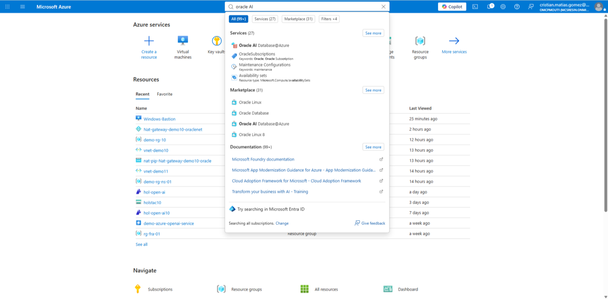
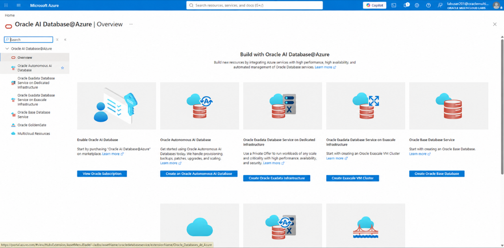
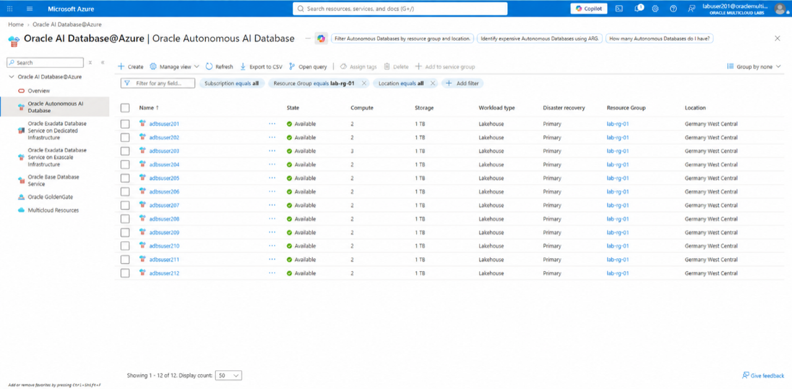
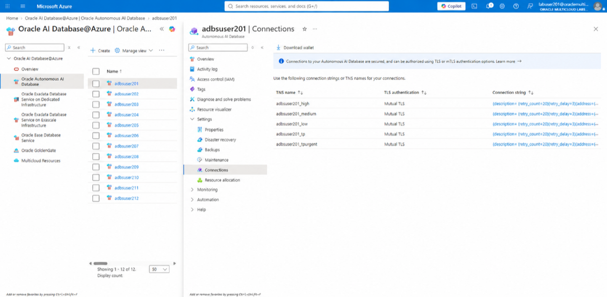
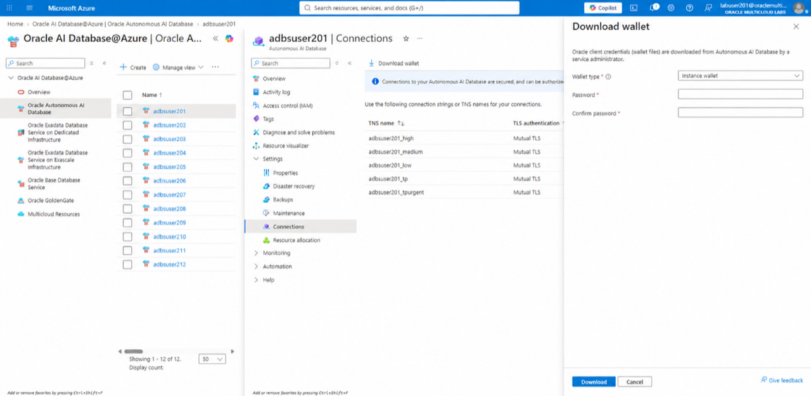
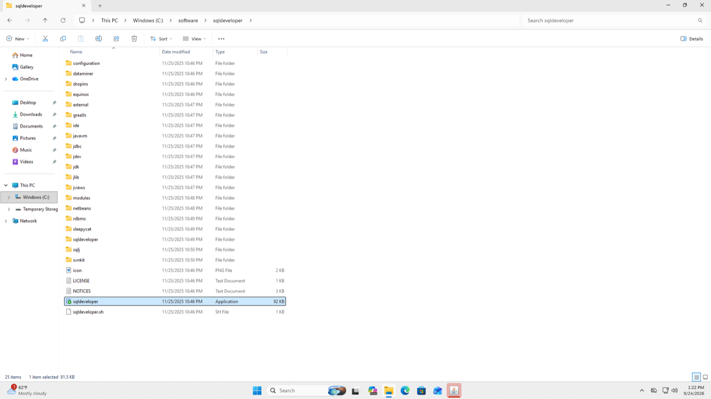
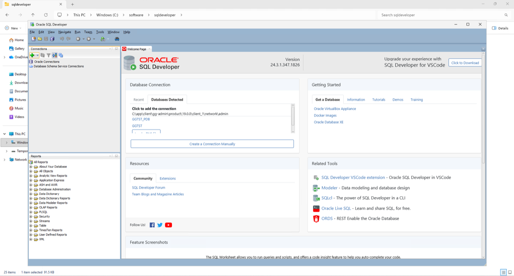
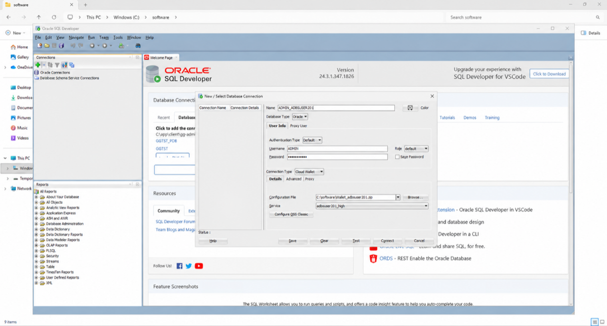
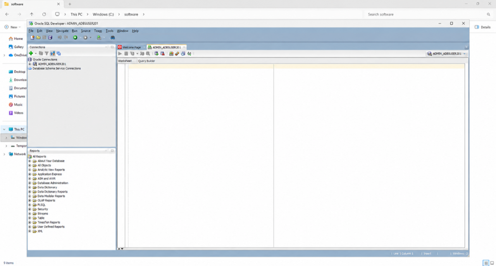

# Connect to Autonomous AI Database Lakehouse

## Introduction

In this lab, you download the wallet for your assigned Autonomous AI Database and create SQL Developer connections for the `ADMIN` and `LAKE_DEMO` users.

Estimated Time: 20 minutes

### Objectives

In this lab, you will:

- Download an instance wallet from Oracle AI Database@Azure
- Create an `ADMIN` connection in SQL Developer
- Create a `LAKE_DEMO` connection for the workshop tasks

## Task 1: Download the Database Wallet

1. From the Windows virtual machine, open a browser and sign in to the [Azure portal](https://portal.azure.com) with the event account.

2. In the Azure portal search bar, enter **Oracle AI Database@Azure**, and open the service.

    

3. In the left menu, select **Oracle Autonomous AI Database**.

    

4. Select the database assigned to your event account. Its numeric suffix should match your assigned user number.

    

5. Under **Settings**, select **Connections**, and then select **Download wallet**.

    

6. Leave **Wallet type** set to **Instance wallet**. Enter and confirm a strong wallet password, and store it securely for the duration of the workshop.

7. Select **Download**.

    

8. Save the wallet ZIP file in `C:\software`. Do not extract the ZIP file.

## Task 2: Create the ADMIN Connection

1. In the Windows virtual machine, open `C:\software\sqldeveloper`, and start the SQL Developer application.

    

2. In the **Connections** panel, select **New Connection**.

    

3. Enter these connection values, replacing `<database-name>` with the name of your assigned database:

    | Field | Value |
    | --- | --- |
    | Name | `ADMIN_<database-name>` |
    | Username | `ADMIN` |
    | Password | The ADMIN password from **View Login Info** |
    | Connection Type | `Cloud Wallet` |
    | Configuration File | `C:\software\Wallet_<database-name>.zip` |
    | Service | `<database-name>_high` |

    

    

4. Select **Test** and confirm that **Status: Success** appears.

    

5. Select **Connect**. A SQL worksheet opens.

    

## Task 3: Create the LAKE_DEMO Connection

1. Create another connection with these values:

    | Field | Value |
    | --- | --- |
    | Name | `LAKE_DEMO_<database-name>` |
    | Username | `LAKE_DEMO` |
    | Password | The LAKE_DEMO password from **View Login Info** |
    | Connection Type | `Cloud Wallet` |
    | Configuration File | `C:\software\Wallet_<database-name>.zip` |
    | Service | `<database-name>_high` |

2. Select **Test** and confirm that **Status: Success** appears.

3. Select **Connect**. Keep both connections available; later tasks identify which user must run each script.

## Acknowledgements

- **Author** - Oracle Multicloud Team
- **Last Updated By/Date** - Oracle LiveLabs, September 2026
