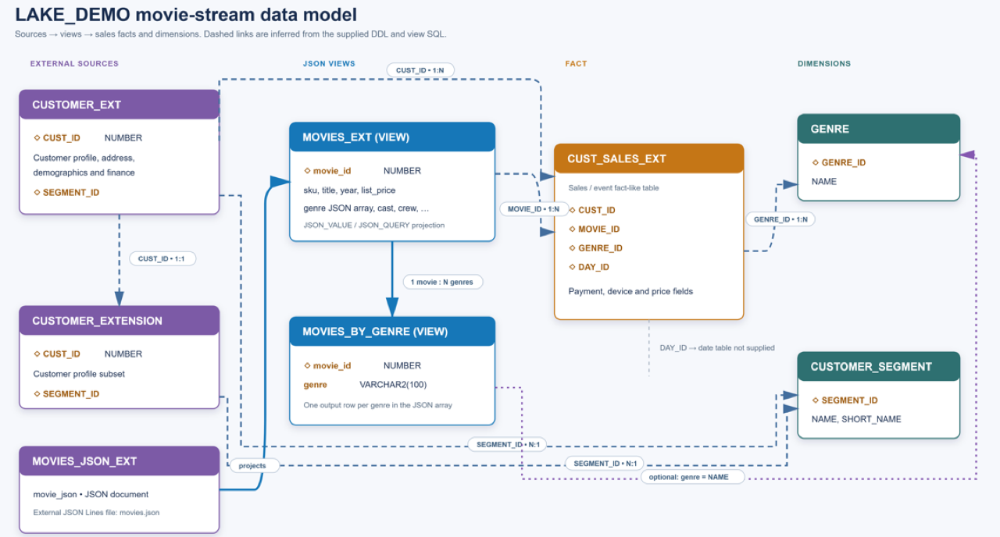

# Create External Tables and Views

## Introduction

In this lab, you expose customer, sales, and movie files in Azure Blob Storage as database objects. The CSV files become external tables, and SQL/JSON views make the movie document data easy to query and describe to the language model.

Estimated Time: 25 minutes

### Objectives

In this lab, you will:

- Create external tables over CSV and JSON files
- Project JSON attributes into relational columns
- Expand each movie's genre array into rows
- Add comments that give Select AI useful business context

The completed model combines three external data sources with pre-created dimension tables in the `LAKE_DEMO` schema.



## Task 1: Create the Customer External Table

1. In SQL Developer, open a worksheet for the `LAKE_DEMO` connection.

2. Run the following script to create `CUSTOMER_EXT` over the customer CSV file:

    ```sql
    BEGIN
      DBMS_CLOUD.CREATE_EXTERNAL_TABLE(
        table_name      => 'CUSTOMER_EXT',
        credential_name => 'AZURE_BLOB_CRED',
        file_uri_list   => 'https://holstac.blob.core.windows.net/hol-lab/data/customer.csv',
        column_list     => q'[
          "CUST_ID"                NUMBER,
          "LAST_NAME"              VARCHAR2(327),
          "FIRST_NAME"             VARCHAR2(327),
          "EMAIL"                  VARCHAR2(327),
          "STREET_ADDRESS"         VARCHAR2(327),
          "POSTAL_CODE"            VARCHAR2(327),
          "CITY"                   VARCHAR2(327),
          "STATE_PROVINCE"         VARCHAR2(327),
          "COUNTRY"                VARCHAR2(327),
          "COUNTRY_CODE"           VARCHAR2(327),
          "CONTINENT"              VARCHAR2(327),
          "YRS_CUSTOMER"           NUMBER,
          "PROMOTION_RESPONSE"     NUMBER,
          "LOC_LAT"                NUMBER,
          "LOC_LONG"               NUMBER,
          "AGE"                    NUMBER,
          "COMMUTE_DISTANCE"       NUMBER,
          "CREDIT_BALANCE"         NUMBER,
          "EDUCATION"              VARCHAR2(327),
          "FULL_TIME"              VARCHAR2(327),
          "GENDER"                 VARCHAR2(327),
          "HOUSEHOLD_SIZE"         NUMBER,
          "INCOME"                 NUMBER,
          "INCOME_LEVEL"           VARCHAR2(327),
          "INSUFF_FUNDS_INCIDENTS" NUMBER,
          "JOB_TYPE"               VARCHAR2(327),
          "LATE_MORT_RENT_PMTS"    NUMBER,
          "MARITAL_STATUS"         VARCHAR2(327),
          "MORTGAGE_AMT"           NUMBER,
          "NUM_CARS"               NUMBER,
          "NUM_MORTGAGES"          NUMBER,
          "PET"                    VARCHAR2(327),
          "RENT_OWN"               VARCHAR2(327),
          "SEGMENT_ID"             NUMBER,
          "WORK_EXPERIENCE"        NUMBER,
          "YRS_CURRENT_EMPLOYER"   NUMBER,
          "YRS_RESIDENCE"          NUMBER
        ]',
        format => JSON_OBJECT(
          'type'        VALUE 'csv',
          'skipheaders' VALUE '1',
          'quote'       VALUE '"'
        )
      );
    END;
    /
    ```

3. Preview the data:

    ```sql
    SELECT *
    FROM CUSTOMER_EXT
    FETCH FIRST 10 ROWS ONLY;
    ```

## Task 2: Create the Sales External Table

1. Run the following script. The wildcard reads all files in the `custsales` path:

    ```sql
    BEGIN
      DBMS_CLOUD.CREATE_EXTERNAL_TABLE(
        table_name      => 'CUST_SALES_EXT',
        credential_name => 'AZURE_BLOB_CRED',
        file_uri_list   => 'https://holstac.blob.core.windows.net/hol-lab/data/custsales/*',
        column_list     => q'[
          "DAY_ID"           DATE,
          "GENRE_ID"         NUMBER,
          "MOVIE_ID"         NUMBER,
          "CUST_ID"          NUMBER,
          "APP"              VARCHAR2(327),
          "DEVICE"           VARCHAR2(327),
          "OS"               VARCHAR2(327),
          "PAYMENT_METHOD"   VARCHAR2(327),
          "LIST_PRICE"       NUMBER,
          "DISCOUNT_TYPE"    VARCHAR2(327),
          "DISCOUNT_PERCENT" NUMBER,
          "ACTUAL_PRICE"     NUMBER
        ]',
        format => JSON_OBJECT(
          'type'        VALUE 'csv',
          'skipheaders' VALUE '1',
          'dateformat'  VALUE 'YYYY-MM-DD',
          'quote'       VALUE '"'
        )
      );
    END;
    /
    ```

2. Preview the data:

    ```sql
    SELECT *
    FROM CUST_SALES_EXT
    FETCH FIRST 10 ROWS ONLY;
    ```

## Task 3: Create the Movie External Table and Views

1. Create an external table in which each row contains one JSON movie document:

    ```sql
    BEGIN
      DBMS_CLOUD.CREATE_EXTERNAL_TABLE(
        table_name      => 'MOVIES_JSON_EXT',
        credential_name => 'AZURE_BLOB_CRED',
        file_uri_list   => 'https://holstac.blob.core.windows.net/hol-lab/data/movies.json',
        column_list     => 'MOVIE_JSON CLOB',
        field_list      => '"MOVIE_JSON" CHAR(10000)',
        format          => JSON_OBJECT('delimiter' VALUE 'X''00''')
      );
    END;
    /
    ```

2. Create a view that projects the JSON attributes into relational columns:

    ```sql
    CREATE OR REPLACE VIEW MOVIES_EXT AS
    SELECT
      JSON_VALUE(movie_json, '$.sku' RETURNING VARCHAR2(32767)) AS sku,
      JSON_QUERY(movie_json, '$.cast' RETURNING JSON) AS "CAST",
      JSON_QUERY(movie_json, '$.crew' RETURNING JSON) AS crew,
      JSON_VALUE(movie_json, '$.year' RETURNING NUMBER) AS year,
      JSON_QUERY(movie_json, '$.genre' RETURNING JSON) AS genre,
      JSON_VALUE(movie_json, '$.gross' RETURNING VARCHAR2(32767)) AS gross,
      JSON_VALUE(movie_json, '$.title' RETURNING VARCHAR2(32767)) AS title,
      JSON_VALUE(movie_json, '$.views' RETURNING NUMBER) AS views,
      JSON_QUERY(movie_json, '$.awards' RETURNING JSON) AS awards,
      JSON_VALUE(movie_json, '$.budget' RETURNING VARCHAR2(32767)) AS budget,
      JSON_QUERY(movie_json, '$.studio' RETURNING JSON) AS studio,
      JSON_VALUE(movie_json, '$.runtime' RETURNING VARCHAR2(32767)) AS runtime,
      JSON_VALUE(movie_json, '$.summary' RETURNING VARCHAR2(32767)) AS summary,
      JSON_VALUE(movie_json, '$.movie_id' RETURNING NUMBER) AS movie_id,
      JSON_VALUE(movie_json, '$.image_url' RETURNING VARCHAR2(32767)) AS image_url,
      JSON_VALUE(movie_json, '$.list_price' RETURNING NUMBER) AS list_price,
      JSON_QUERY(movie_json, '$.nominations' RETURNING JSON) AS nominations,
      JSON_VALUE(movie_json, '$.main_subject' RETURNING VARCHAR2(32767)) AS main_subject,
      JSON_VALUE(movie_json, '$.opening_date' RETURNING DATE) AS opening_date,
      JSON_VALUE(movie_json, '$.wiki_article' RETURNING VARCHAR2(32767)) AS wiki_article
    FROM MOVIES_JSON_EXT;
    ```

3. Create a second view that expands the JSON genre array to one row per movie and genre:

    ```sql
    CREATE OR REPLACE VIEW MOVIES_BY_GENRE AS
    SELECT m.movie_id,
           m.sku,
           m.title,
           m.year,
           m.list_price,
           m.views,
           m.opening_date,
           g.genre
    FROM MOVIES_EXT m,
         JSON_TABLE(
           m.genre,
           '$[*]'
           COLUMNS (
             genre VARCHAR2(100) PATH '$'
           )
         ) g;
    ```

4. Verify the views:

    ```sql
    SELECT movie_id, title, genre
    FROM MOVIES_BY_GENRE
    FETCH FIRST 10 ROWS ONLY;
    ```

## Task 4: Add Metadata for Select AI

1. Add comments that explain the purpose of the views and genre column:

    ```sql
    COMMENT ON TABLE LAKE_DEMO.MOVIES_EXT IS
      'One row per movie from external movies.json. Includes movie attributes and JSON array columns.';

    COMMENT ON TABLE LAKE_DEMO.MOVIES_BY_GENRE IS
      'One row per movie and genre. Use for exact genre filtering, grouping, and joins.';

    COMMENT ON COLUMN LAKE_DEMO.MOVIES_BY_GENRE.GENRE IS
      'Individual movie genre, for example Drama, Thriller, Comedy, or Biography.';
    ```

2. Confirm that all workshop objects are available:

    ```sql
    SELECT object_name, object_type, status
    FROM user_objects
    WHERE object_name IN (
      'CUSTOMER_EXT',
      'CUST_SALES_EXT',
      'MOVIES_JSON_EXT',
      'MOVIES_EXT',
      'MOVIES_BY_GENRE'
    )
    ORDER BY object_name;
    ```

3. Confirm that each listed object has a status of `VALID`.

## Acknowledgements

- **Author** - Oracle Multicloud Team
- **Last Updated By/Date** - Oracle LiveLabs, September 2026
