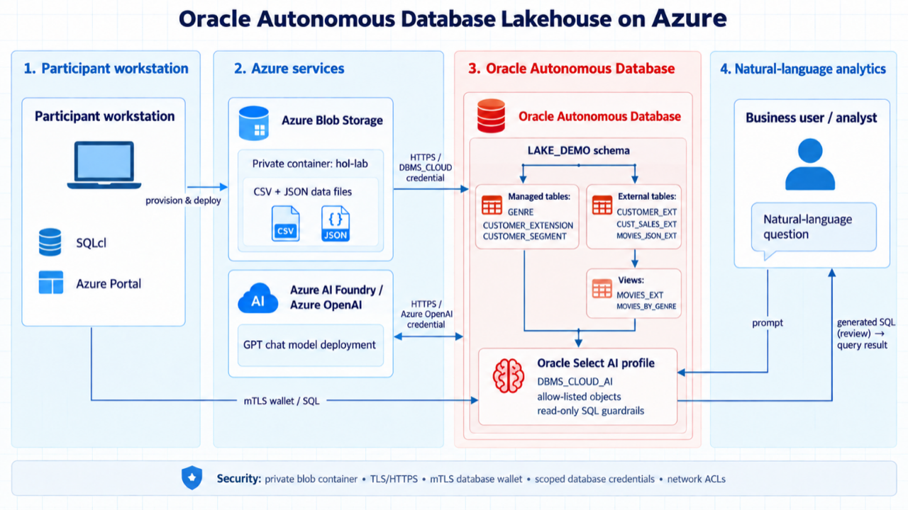
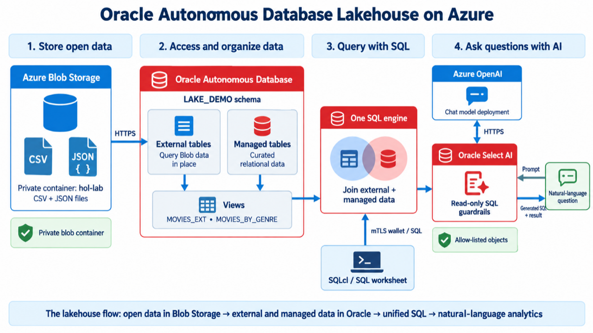

# Build a Data Lake with Autonomous AI Lakehouse

## Introduction

Oracle Autonomous AI Database Lakehouse on Oracle AI Database@Azure provides a governed lakehouse close to Azure applications. It combines Autonomous AI Database performance, security, and automated management with access to data in Azure Blob Storage.

In this workshop, you connect to a pre-provisioned Autonomous AI Database, expose CSV and JSON files in Azure Blob Storage as external tables, create relational views over JSON data, and use Select AI with Azure OpenAI to generate SQL from natural-language questions.

The completed workflow keeps source data in Azure Blob Storage while Oracle Autonomous AI Database supplies SQL access, governance, and AI-assisted analytics.

### Objectives

In this workshop, you will:

- Access the temporary Azure event environment and its Windows virtual machine
- Download an Autonomous AI Database wallet and configure Oracle SQL Developer
- Create a database credential for Azure Blob Storage
- Build external tables and views over CSV and JSON data
- Configure Select AI to use an Azure OpenAI deployment
- Generate, review, and run SQL from natural-language prompts

### Prerequisites

- A LiveLabs event reservation with access to **View Login Info**
- A mobile device that can run Microsoft Authenticator
- Familiarity with SQL and basic database concepts

Estimated Workshop Time: 1 hour 30 minutes

## Acknowledgements

- **Author** - Oracle Multicloud Team
- **Last Updated By/Date** - Oracle LiveLabs, September 2026
