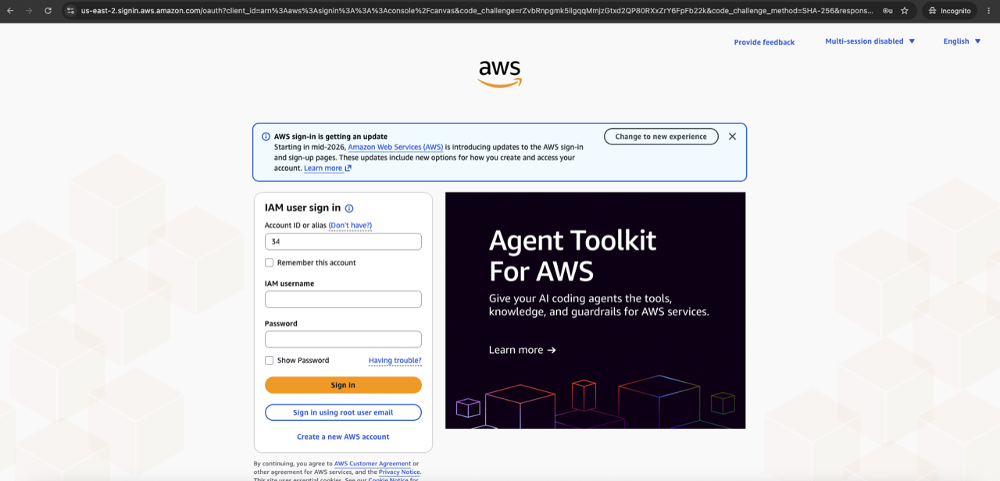
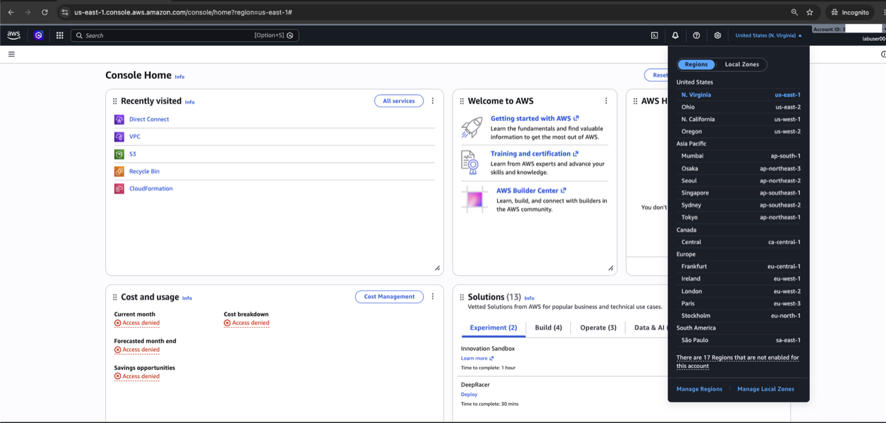

# AWS Event Account

## Introduction

In this module, you sign in to the AWS event account and select the AWS Region used by the workshop.

### Objectives

* Sign in to the assigned AWS event account.
* Select and verify the workshop AWS Region.

Estimated Time: 5 minutes

## Task 1: Sign in to AWS

1. Open the AWS console sign-in URL supplied by the instructor.
2. Sign in with the assigned IAM username and password.

    

## Task 2: Select the AWS Region

1. Open the Region selector in the upper-right corner of the AWS console.
2. Select **US East (N. Virginia)**.
3. Confirm that the console shows `us-east-1`.

    

## Summary

You are signed in to the correct AWS account and Region.

## Acknowledgements

* **Author** - Arun Ramakrishnan
* **Last Updated By/Date** - David Start, October 2026
