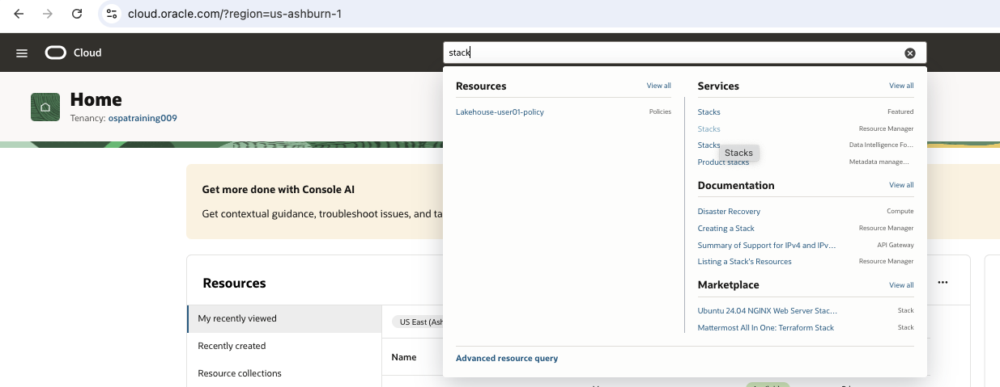
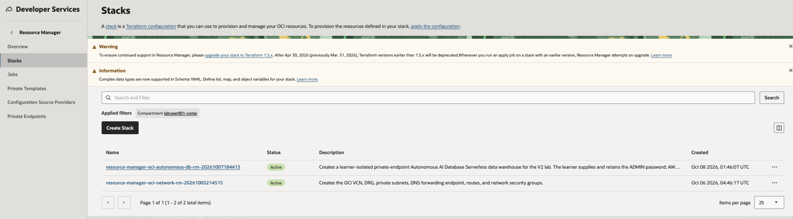
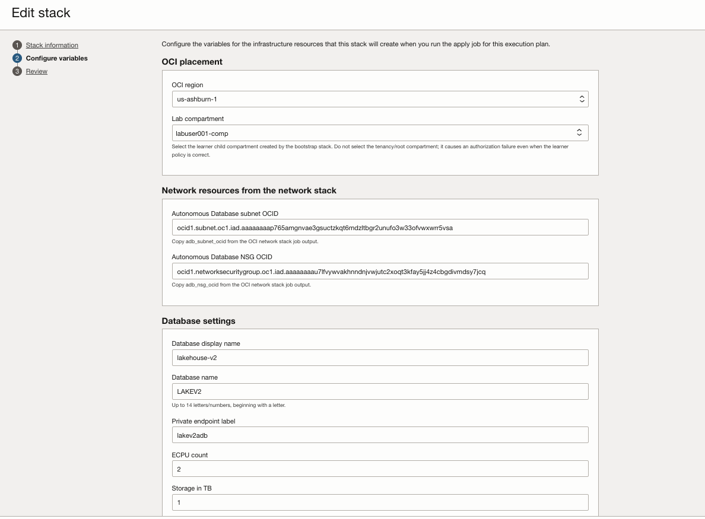
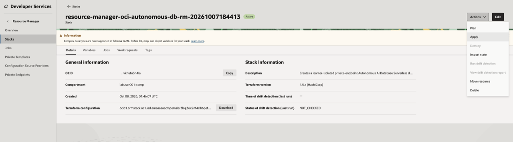
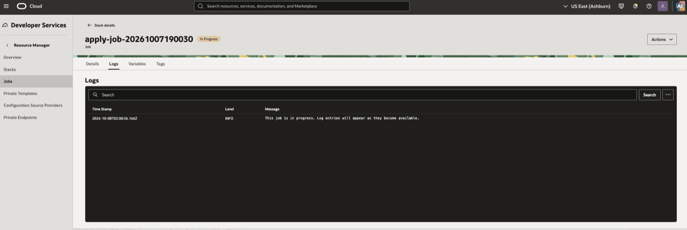
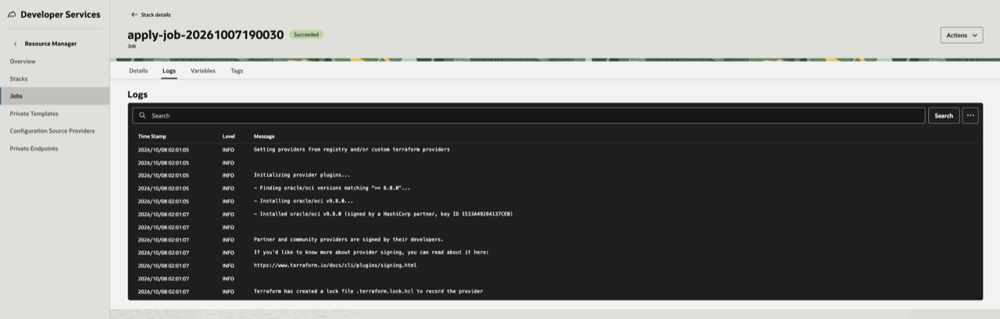
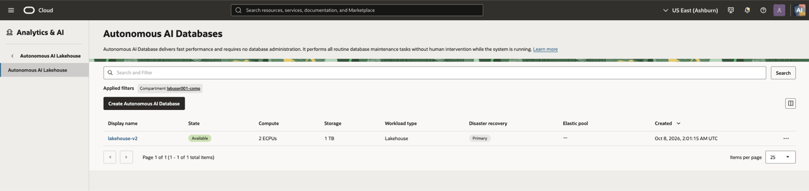
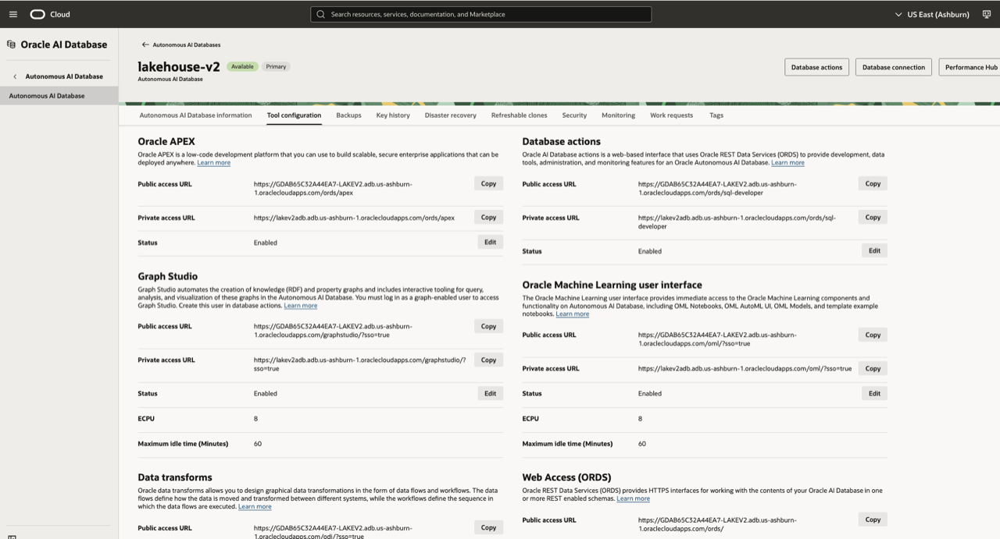
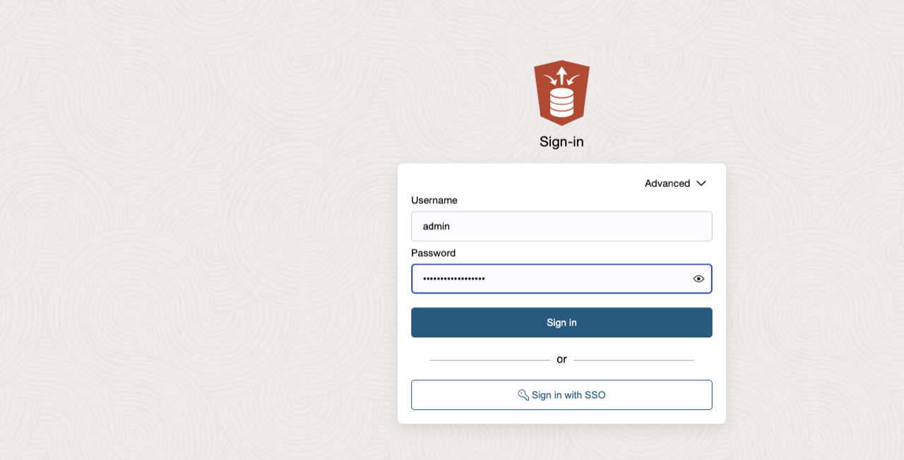

# Create Autonomous AI Lakehouse

## Introduction

In this module, you create an Autonomous AI Lakehouse with a private endpoint in the OCI subnet prepared for the lab.

### Objectives

* Apply the pre-staged Autonomous AI Lakehouse Resource Manager stack.
* Verify the private endpoint and sign in to Database Actions.

Estimated Time: 15 minutes

## Task 1: Apply the Autonomous AI Lakehouse stack

1. The lab administrator has pre-staged the Autonomous AI Lakehouse Resource Manager stack in your assigned learner compartment. Its name follows the naming convention **`resource-manager-oci-autonomous-db-rm`**. Do not create a new stack.

2. From the OCI Console navigation menu, open **Developer Services** → **Resource Manager** → **Stacks**.

    

3. Use the **Compartment** selector to choose your assigned lab compartment. In the stack list, find and select the stack whose name begins with **`resource-manager-oci-autonomous-db-rm`**.

    

4. On the stack details page, select **Edit variables**. Do not change the Terraform configuration or provider settings.

    

5. Set the variables as follows, then click **Save changes**:

    | Variable | Value |
    |---|---|
    | `compartment_ocid` | Your learner compartment OCID, beginning `ocid1.compartment...` |
    | `adb_subnet_ocid` | The `adb_subnet_ocid` copied while inspecting the private subnet in the **Verify OCI Lab Environment** module |
    | `adb_nsg_ocid` | The `adb_nsg_ocid` copied while inspecting the NSG in the **Verify OCI Lab Environment** module |
    | `public_access_cidr` | Your workstation public IP in `/32` form, or approved corporate/VPN CIDR |
    | `admin_password` | A new strong password for the ADB `ADMIN` user |

6. Do **not** use the tenancy OCID for `compartment_ocid`. Before saving, confirm that `adb_subnet_ocid` and `adb_nsg_ocid` begin with `ocid1.subnet` and `ocid1.networksecuritygroup`, respectively.

7. On the stack details page, select **Plan**. After the plan succeeds, verify that the planned `compartment_id` begins with `ocid1.compartment`, then select **Apply** and confirm the apply job.

    

8. Monitor the apply job until it completes. The Autonomous AI Lakehouse creation can take several minutes.

    

9. Continue only when the apply job status is **Succeeded**.

    

## Task 2: Verify the private endpoint and open Database Actions

1. From the OCI Console navigation menu, open **Oracle Database** → **Autonomous AI Lakehouse**. Set the **Compartment** selector to your assigned lab compartment, then select the Autonomous AI Lakehouse created by the stack.

    

2. On the details page, confirm that the private endpoint, private endpoint IP, subnet, and NSG are populated.

3. Select the **Tool configuration** tab. In the **Database Actions** section, locate the **Public access URL**. Open this URL in your browser; it lets you use Database Actions from your workstation while the database's outbound connection remains private.

    

4. At the Database Actions sign-in page, enter `ADMIN` as the username and the `admin_password` you set in Task 1, then sign in.

    

## Summary

You created an Autonomous AI Lakehouse in the private OCI subnet.

## Acknowledgements

* **Author** - Arun Ramakrishnan
* **Last Updated By/Date** - David Start, October 2026
