# Create Oracle AWS Interconnect

## Introduction

In this module, you establish the managed Oracle--AWS Interconnect between the DRG and AWS Direct Connect gateway.

### Objectives

* Create the OCI side of Oracle--AWS Interconnect.
* Accept the connection from AWS and verify both providers report a healthy connection.

Estimated Time: 15 minutes

## Task 1: Create the OCI side

1. In the OCI Console navigation menu, open **Networking** → **Customer connectivity** → **FastConnect**.

    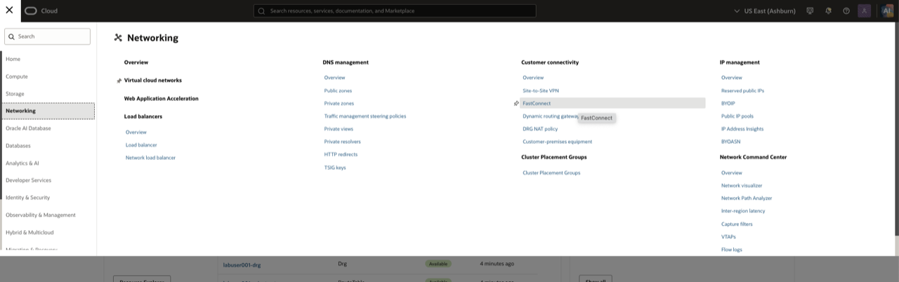

2. At the top of the FastConnect page, use the **Compartment** selector to choose **your assigned lab compartment**. Confirm that the compartment name matches the one provided by the lab administrator. The DRG created in the previous module is in this compartment.

3. Click **Create FastConnect**. Under **FastConnect type**, select **FastConnect interconnect**, then select **Oracle Interconnect for AWS**.

    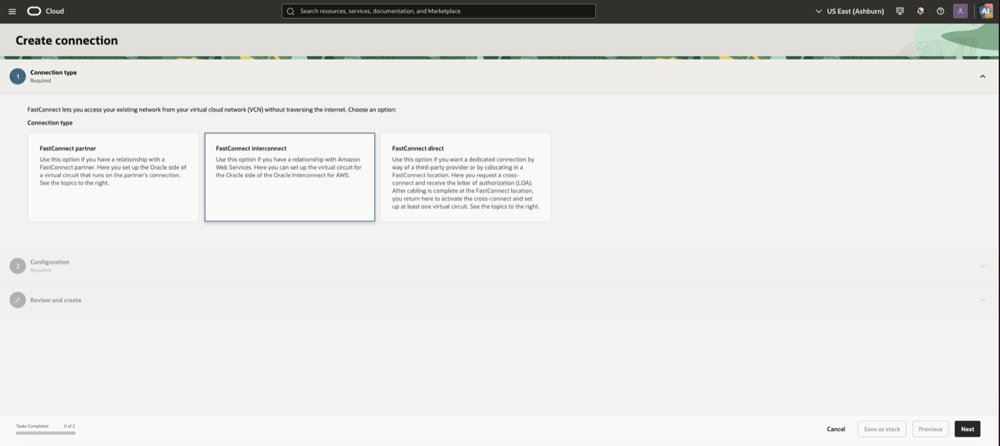

4. Select **Configure in OCI first**.

    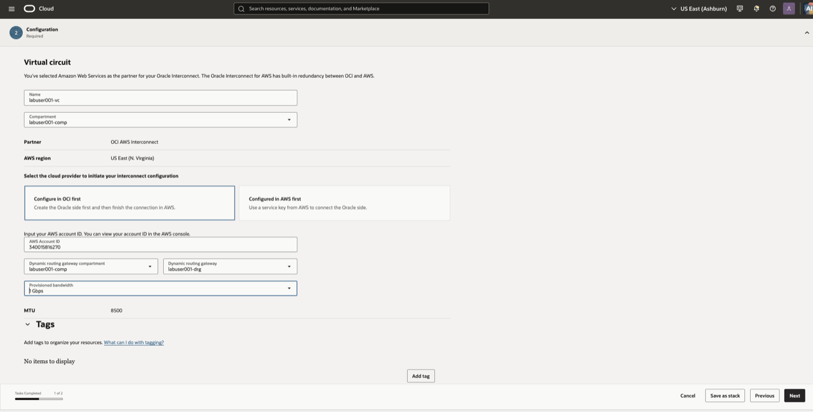

5. For the DRG, select the DRG created by the OCI network Resource Manager stack. Its OCID is the `drg_ocid` value recorded in the **Verify OCI Lab Environment** module.

6. Enter the 12-digit **AWS account ID** for the AWS event account used in this lab. Obtain it from the lab administrator, or sign in to the AWS Console and open the account menu in the upper-right corner to copy the account ID. Verify the number before proceeding; it determines which AWS account can accept this Interconnect request.

7. Review the values, then click **Create**.

8. Wait for the virtual circuit to show **PENDING PARTNER**.

    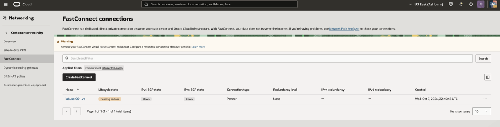

9. Copy the **activation key**. Keep it available only long enough to complete Task 2; it is required to accept the connection in AWS.

    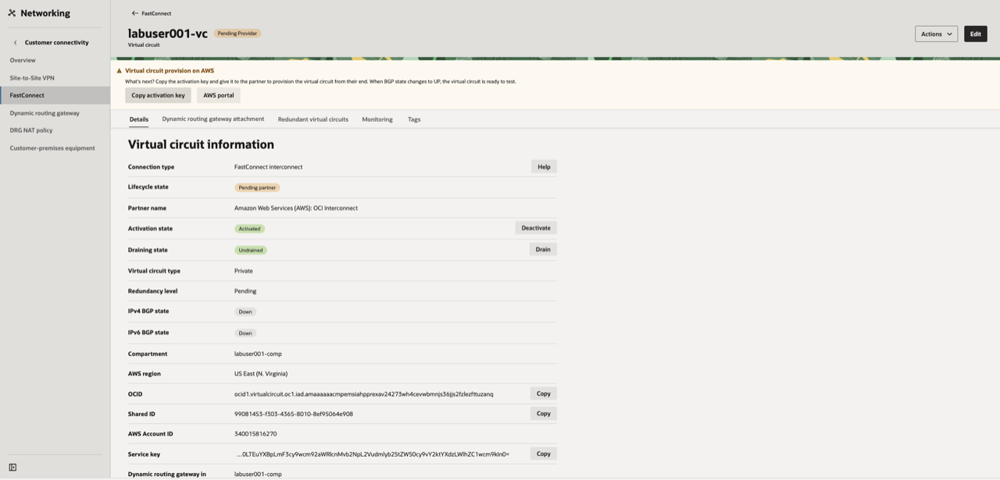

## Task 2: Accept the AWS side

1. In the AWS Console, search for and open **Direct Connect**.

    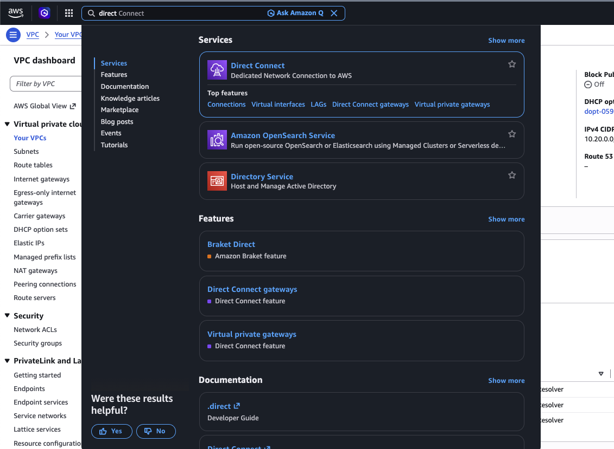

2. In the Direct Connect navigation pane, choose **AWS Interconnect**.

    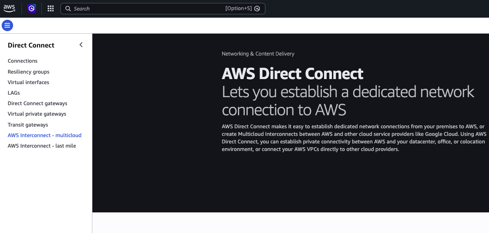

3. Choose **Accept multicloud Interconnect**.

    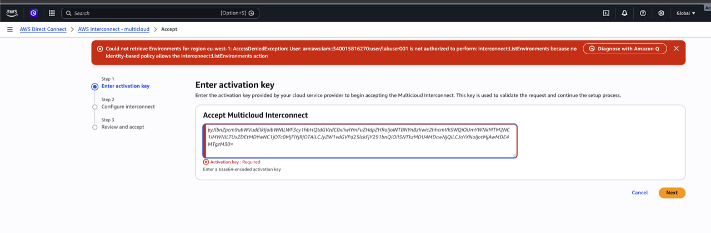

4. Paste the OCI activation key copied in Task 1, then select the lab Direct Connect gateway from the `DirectConnectGatewayId` value recorded in the **Verify AWS Lab Environment** module.

    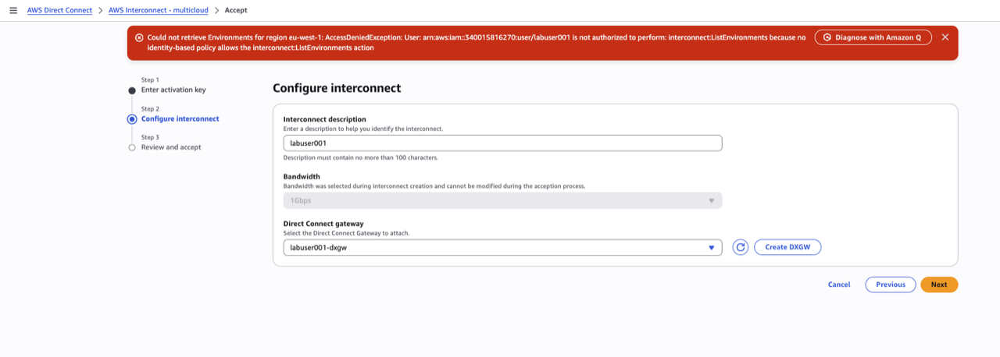

5. Enter a description and add the `LabUser` tag value from the CloudFormation outputs when the console offers tags. Review the connection details and accept the connection.

    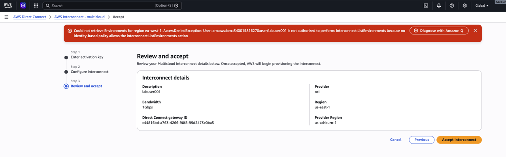

6. Wait for AWS to show the connection in **Pending partner** status while Oracle completes provisioning.

    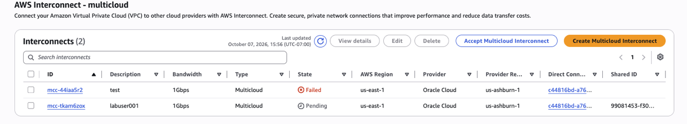

## Task 3: Verify the connection

1. Return to OCI FastConnect and wait for lifecycle state **PROVISIONED** and BGP state **UP**.

    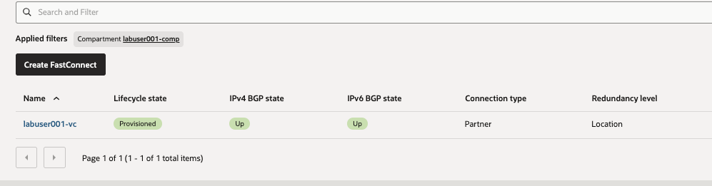

2. In AWS Interconnect, confirm the connection is **Available**.

    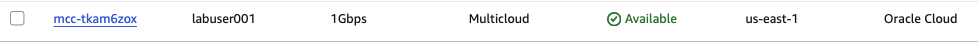

    Do not continue until both providers report a healthy connection.

## Summary

The OCI DRG and AWS Direct Connect gateway are connected by Oracle--AWS Interconnect.

## Acknowledgements

* **Author** - Arun Ramakrishnan
* **Last Updated By/Date** - David Start, October 2026
