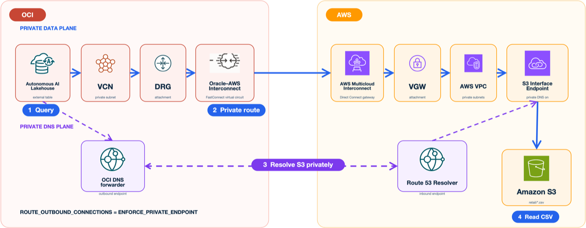

# Introduction

## Introduction

In this workshop, you will query Amazon S3 CSV data from an OCI Autonomous AI Lakehouse over Oracle--AWS Interconnect. An Amazon S3 Interface VPC Endpoint and enforced private outbound database routing keep the data path off the public internet.

The event environments use AWS CloudFormation and OCI Resource Manager for repeatable infrastructure. The instructor pre-stages the foundations; learners verify them, establish the managed interconnect, create the Autonomous AI Lakehouse, and query the CSV data.

Estimated Workshop Time: 90 minutes

### Objectives

In this workshop, you will:

* Verify the pre-staged AWS VPC, S3 bucket, Interface VPC Endpoint, Direct Connect gateway, and restricted IAM users
* Verify the OCI VCN, private Autonomous Database subnet, Dynamic Routing Gateway (DRG), DNS forwarding, and Network Security Group (NSG)
* Establish Oracle--AWS Interconnect between the two environments
* Create an Autonomous AI Lakehouse with a private endpoint
* Enforce private outbound database routing and query the S3 CSV files

## Key takeaways

After completing this lab, you will understand how easily you can establish a fully managed private interconnect between OCI and AWS environments. You will have built and validated a practical data path from an Autonomous AI Lakehouse in OCI to Amazon S3 in AWS without sending the database-to-S3 traffic across the public internet.

## Oracle--AWS Interconnect benefits

* Fully managed, private interconnect solution powered by Oracle FastConnect and AWS Direct Connect technologies.
* Simplified network setup that abstracts the underlying connectivity between OCI and AWS.
* High-speed dedicated bandwidth, with virtual circuits up to 100 Gbps and scalability to multiple terabits.
* Automated redundancy and load balancing.
* Managed encryption enabled by default.
* Collaborative support model.

### Prerequisites

To complete this workshop, you need:

* An AWS account with permission to create CloudFormation, VPC, Direct Connect, S3, and IAM resources
* An OCI tenancy with permission to create Resource Manager, Networking, FastConnect, and Compute resources
* An OCI compartment for the lab resources
* Access to AWS US East (N. Virginia), `us-east-1`
* Access to OCI US East (Ashburn), `us-ashburn-1`

## Private query path

The private query path is:



```text
Autonomous AI Lakehouse private endpoint -> VCN -> DRG -> Oracle--AWS Interconnect
-> AWS Direct Connect gateway -> VGW -> AWS VPC -> S3 Interface Endpoint -> S3 bucket
```

The AWS policies require `aws:SourceVpce` to match the S3 interface endpoint created for this workshop. A request sent through a public S3 route does not satisfy that condition.

The default networks use OCI `10.10.0.0/16` and AWS `10.20.0.0/16`. You must choose different, non-overlapping CIDR blocks if either range conflicts with an existing network.

## Workshop structure

Follow the ten modules in the workshop navigation. The walkthrough moves from event-account access and foundation verification to Interconnect, lakehouse creation, private-route enforcement, and the S3 query.

## Learn More

* [Oracle Interconnect for AWS](https://docs.oracle.com/en-us/iaas/Content/multicloud/interconnect-aws.htm)
* [AWS multicloud Interconnect setup](https://docs.aws.amazon.com/interconnect/latest/userguide/getting-started-multicloud.html)
* [Amazon S3 PrivateLink interface endpoints](https://docs.aws.amazon.com/AmazonS3/latest/userguide/privatelink-interface-endpoints.html)

## Acknowledgements

* **Author** - Arun Ramakrishnan
* **Last Updated By/Date** - David Start, October 2026
