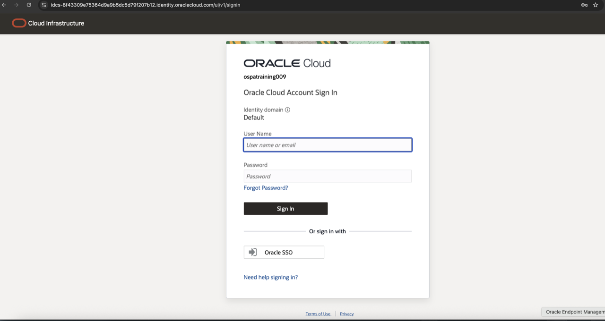
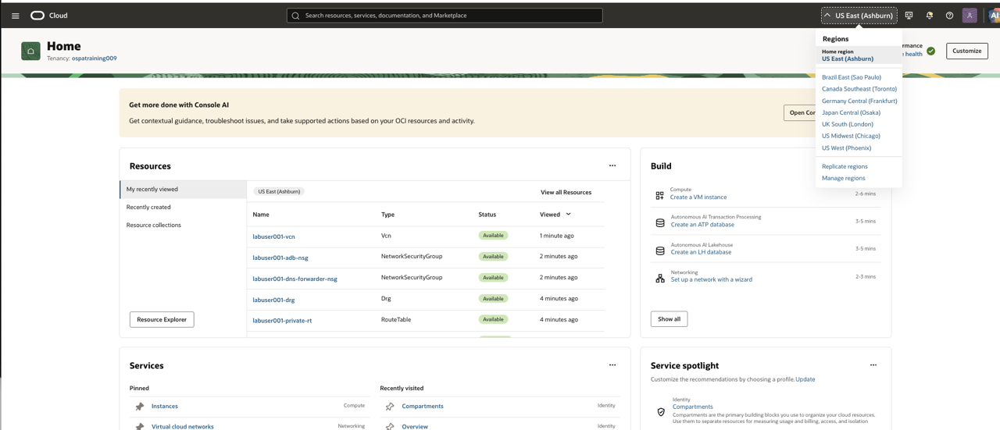

# OCI Event Account

## Introduction

In this module, you sign in to OCI and select the compartment and Region assigned to your lab.

### Objectives

* Sign in to the assigned OCI event account.
* Select and verify the workshop Region and learner compartment.

Estimated Time: 5 minutes

## Task 1: Sign in to OCI

1. Open the OCI console URL supplied by the instructor.
2. Sign in with your assigned Identity Domain user.

    

3. Select **US East (Ashburn)** from the Region menu. Confirm the Region is `us-ashburn-1`.

    

4. Open the compartment selector and select your assigned learner compartment. Do not select the tenancy/root compartment.

## Summary

You are working in the correct OCI Region and learner compartment.

## Acknowledgements

* **Author** - Arun Ramakrishnan
* **Last Updated By/Date** - David Start, October 2026
