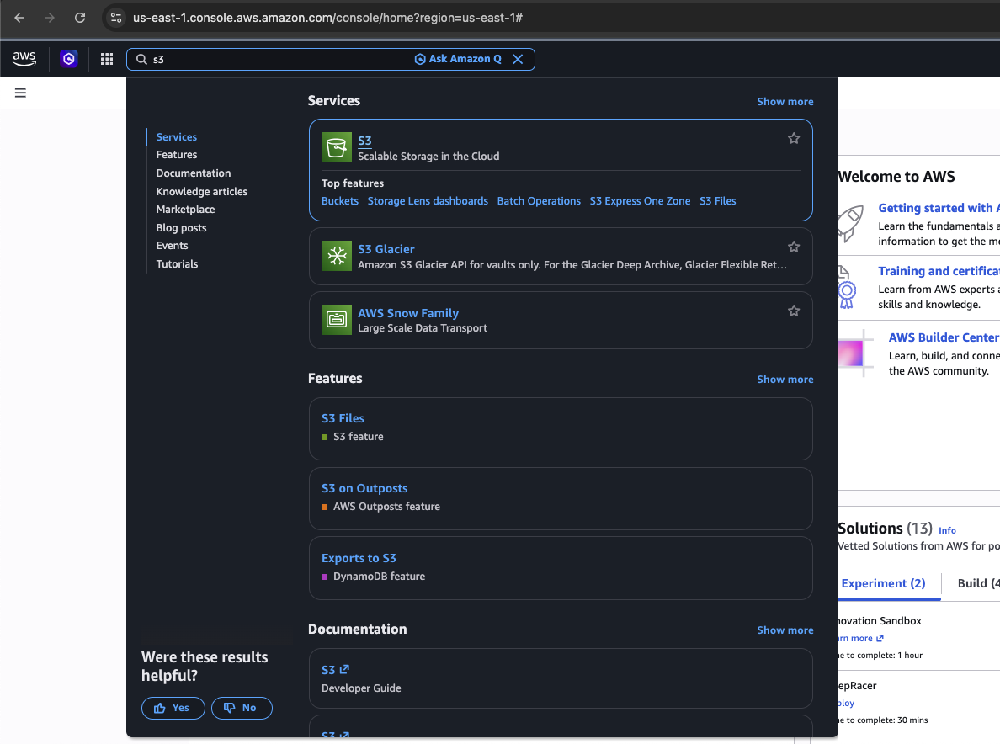
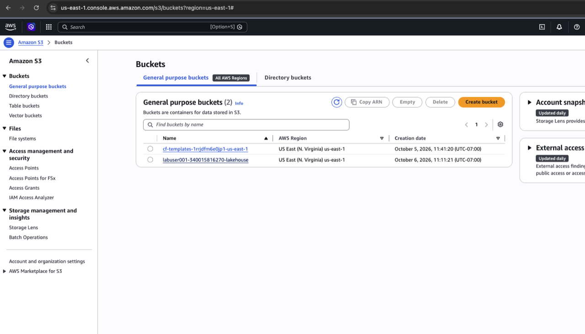
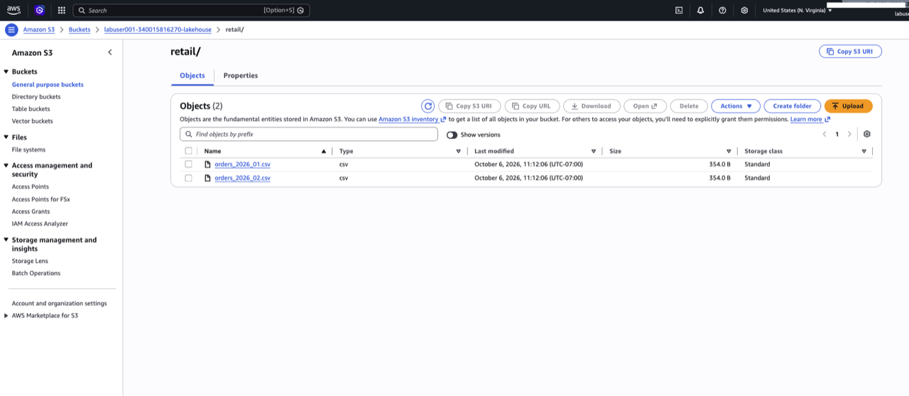
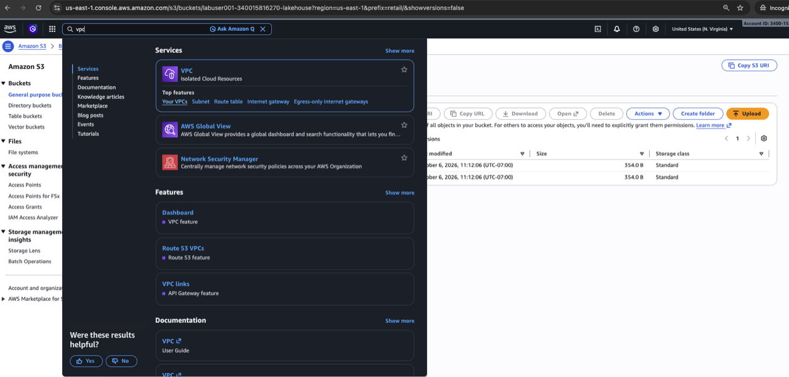
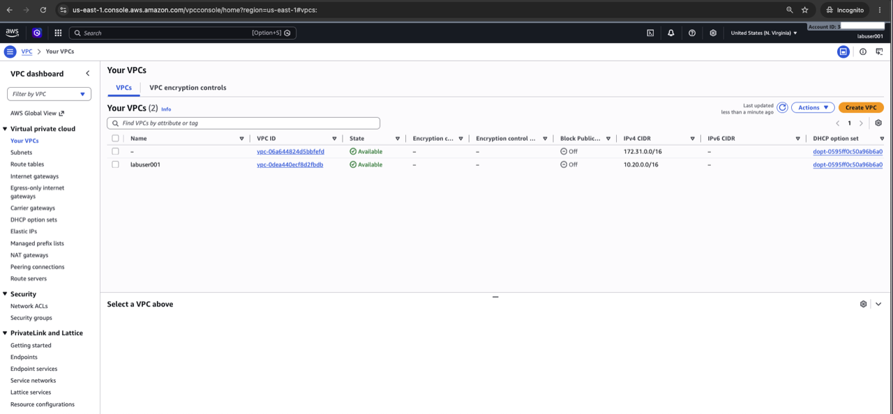
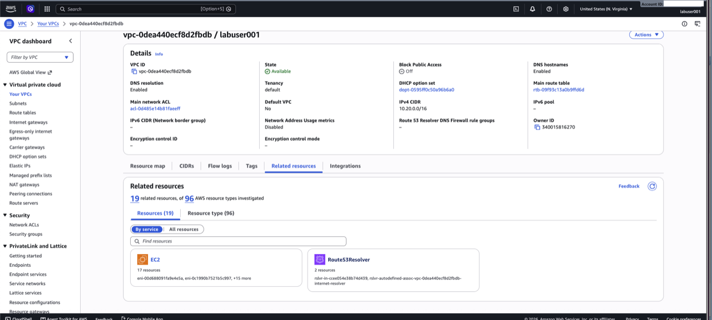
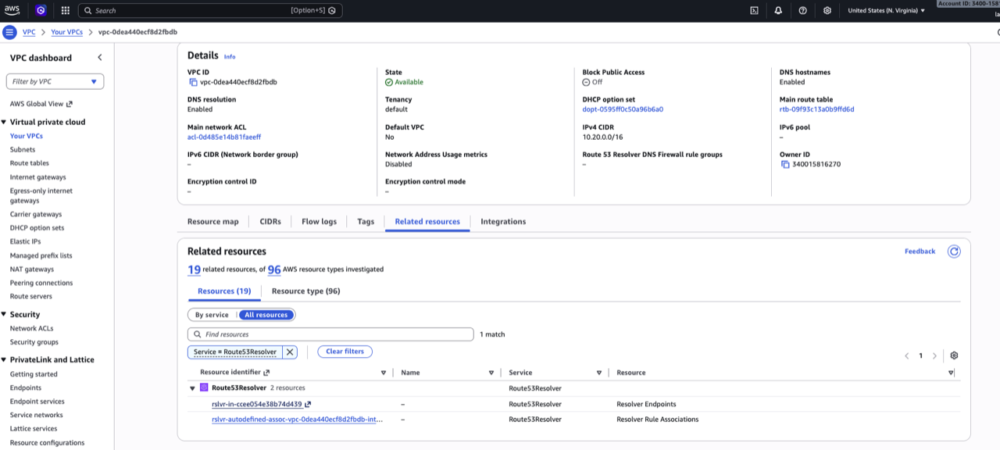
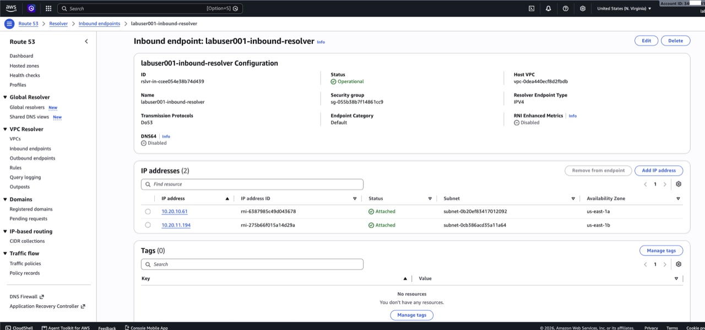

# Verify AWS Lab Environment

## Introduction

The instructor pre-stages the AWS foundation. In this module, you inspect the S3 data source and the AWS private-network components used by the lab.

### Objectives

* Verify the pre-staged Amazon S3 data source.
* Verify the AWS private endpoint and DNS components used by the lab.

Estimated Time: 10 minutes

## Task 1: Verify the S3 data source

1. Open **S3** from the AWS Services menu.

    

2. Select the lab bucket assigned by the instructor.

    

3. Open the `retail/` prefix.
4. Confirm that `orders_2026_01.csv` and `orders_2026_02.csv` are present.
5. Open one file and confirm it contains CSV order data.

    

## Task 2: Verify private S3 and DNS components

1. Open the AWS Services menu, search for **VPC**, and select **VPC**.

    

2. In the VPC console navigation pane, select **Your VPCs**. Select the lab VPC assigned by the instructor.

    

3. Open the VPC details page and select the **Resource map** or **Related resources** view.

    

4. In the related resources, locate and select the **Route 53 Resolver endpoint** associated with the lab VPC.

    

5. Confirm that the endpoint direction is **Inbound**. In its IP address list, copy either resolver IP address. You will use this IP address as `aws_resolver_inbound_ip` in the OCI network stack.

    

6. From the same VPC, open **Endpoints** and confirm that the S3 endpoint type is **Interface**, Private DNS is enabled, and it belongs to the lab VPC.

## Summary

You verified the pre-staged AWS S3 data, private endpoint, DNS resolver, and Direct Connect gateway.

## Acknowledgements

* **Author** - Arun Ramakrishnan
* **Last Updated By/Date** - David Start, October 2026
