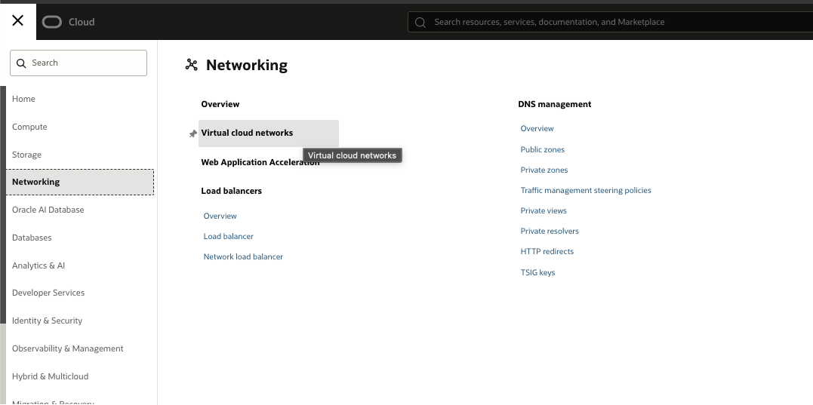
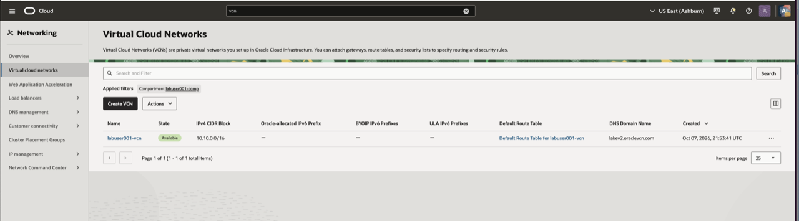
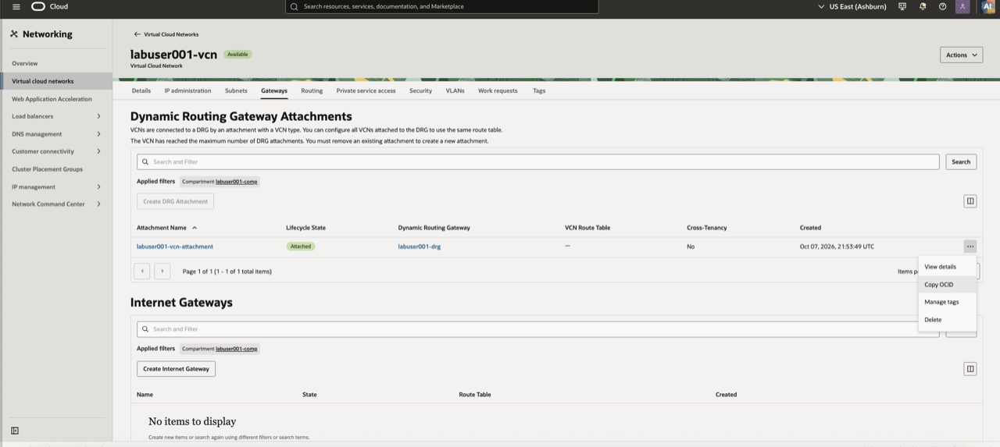
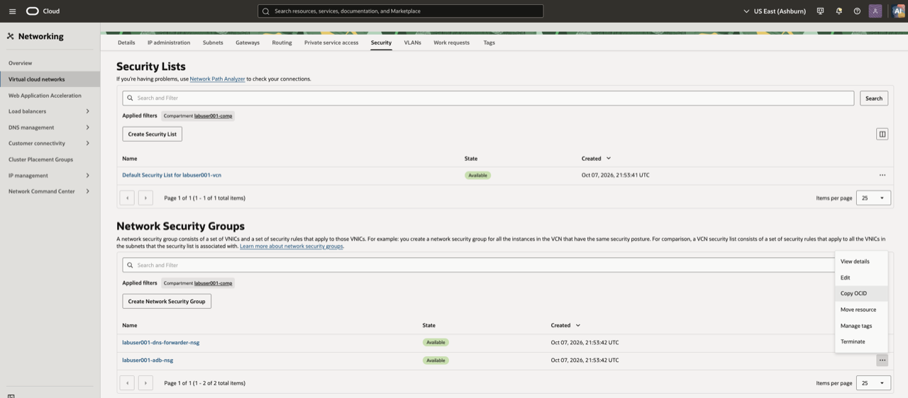
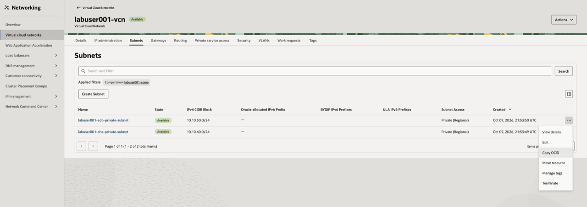

# Verify OCI Lab Environment

## Introduction

The lab administrator has pre-staged the OCI networking components for your assigned compartment. In this module, you verify that foundation and record the values needed to create the Interconnect and Autonomous AI Lakehouse.

### Objectives

* Verify the pre-staged OCI network foundation.
* Record the DRG, NSG, and subnet OCIDs required by later modules.

Estimated Time: 10 minutes

## Task 1: Review the pre-staged OCI network

1. The lab administrator has already deployed the VCN, private subnet, network security group (NSG), route table, DRG, and DNS configuration into your assigned lab compartment.
2. Do not run a new plan or apply job for the network stack during this task. You only need to inspect the pre-staged resources and record their outputs.
3. If a lab administrator asks you to confirm the stack inputs, open **Developer Services** → **Resource Manager** → **Stacks**, then open the assigned network stack in your learner compartment. The key inputs are:
    * `compartment_ocid` — your learner **compartment** OCID, not the tenancy OCID.
    * `aws_vpc_cidr` — the AWS VPC CIDR from the lab handout.
    * `aws_resolver_inbound_ip` — an IP address from the AWS Route 53 inbound resolver.

## Task 2: Inspect the OCI network and record OCIDs

1. From the OCI Console navigation menu, open **Networking** → **Virtual cloud networks**.

    

2. Confirm that the compartment selector is set to your assigned lab compartment. Select the VCN created by the pre-staged network stack.

    

3. On the VCN details page, select **Gateways**. Confirm the Dynamic Routing Gateway (DRG) created for the lab is attached and available. Open the DRG, use **Actions** → **Copy OCID**, and save the value as `drg_ocid` for the Interconnect module.

    

4. Select **Security** → **Network security groups**. Confirm that the pre-staged Autonomous AI Lakehouse NSG is present. Open the NSG, use **Actions** → **Copy OCID**, and save the value as `adb_nsg_ocid` for the Autonomous AI Lakehouse module.

    

5. Select **Subnets**. Confirm that the Autonomous Database subnet is private and has the expected CIDR. Open the subnet, use **Actions** → **Copy OCID**, and save the value as `adb_subnet_ocid` for the Autonomous AI Lakehouse module. Open its route table and confirm that the AWS VPC CIDR route targets the DRG.

    

## Summary

Your OCI network foundation, DRG, private subnet, NSG, and DNS forwarding configuration are ready.

## Acknowledgements

* **Author** - Arun Ramakrishnan
* **Last Updated By/Date** - David Start, October 2026
